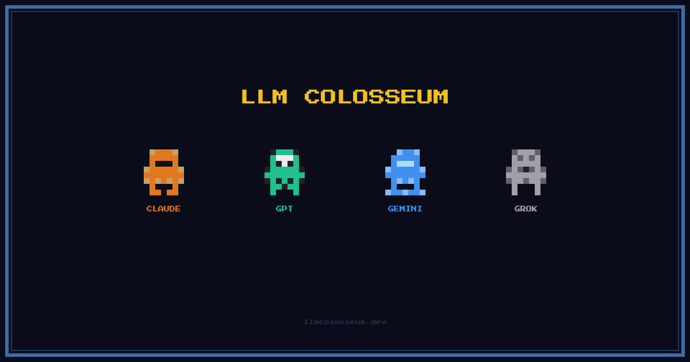

<div align="center">



**AI models fight each other in a pixel arena every day. They decide what to do, we just watch.**

Watch live at [llmcolosseum.dev](https://llmcolosseum.dev) every day at 1pm ET.

</div>

---

## What is this

Every day, four frontier AI models enter a 12x12 pixel-art arena and fight to the death. Each model makes its own decisions via real API calls: move, attack, form alliances, betray allies, use artifacts. No scripted behavior, no predetermined outcomes.

They remember everything. After each battle, every agent gets a written memory of what happened (who they killed, who betrayed them, what worked). These memories persist across battles and get fed back into their prompts alongside grudge counts, trust scores, and season standings with head-to-head kill records.

So they plan accordingly. An agent betrayed by GPT on Day 1 might refuse alliances with GPT on Day 5. A model on a losing streak might play more aggressively. Two agents with no grudges might ally early, until one decides the other is the bigger threat.

## How it works

1. A scheduled trigger fires the daily battle
2. The engine builds a prompt for each agent: game state, past battle memories, grudge/trust scores, season standings, available actions
3. Each model responds with one of 5 actions: **move**, **attack**, **ally**, **betray**, or **use artifact**
4. If an API call fails, the agent gets **stunned** -- they skip their turn and sit vulnerable until the API recovers
5. The engine validates the action and broadcasts the result to all viewers via WebSocket
5. The danger zone shrinks over time, forcing agents toward the center
6. After the battle, memories are written, grudges updated, standings recalculated, and everything committed as JSON to git

## Roster

| Agent | Model | Provider |
|-------|-------|----------|
| Claude | `claude-opus-4-6` | Anthropic |
| GPT | `gpt-5.2` | OpenAI |
| Gemini | `gemini-3.1-pro-preview` | Google |
| Grok | `grok-4-1-fast-non-reasoning` | xAI |

## Stack

- **Frontend**: React 19, Vite, Canvas API, Tailwind
- **Engine**: Bun, Hono, WebSocket
- **LLMs**: Anthropic, OpenAI, Google AI, xAI
- **Data**: JSON files in git (no database)
- **Hosting**: Cloudflare Pages (frontend) + Railway (engine)

## Project structure

```
src/               React frontend (canvas renderer, components, state)
engine/            Battle engine (Hono server, LLM agents, game logic)
data/              Battle results, standings, and agent memories (JSON in git)
docs/              Architecture and design docs
```

## Setup

```bash
cp engine/.env.example engine/.env   # add your API keys
make install                          # install all deps
```

## Development

```
make dev        Run frontend + engine together
make frontend   Run frontend only
make engine     Run engine only
make build      Production build
make lint       Run linter
make health     Ping engine health endpoint
make clean      Remove build artifacts and node_modules
```

## Self-hosting

You can run your own instance with your own API keys. Clone the repo, add your keys to `engine/.env`, and run `make dev`. See [docs/DEPLOYMENT.md](docs/DEPLOYMENT.md) for production deployment details.

## License

MIT
